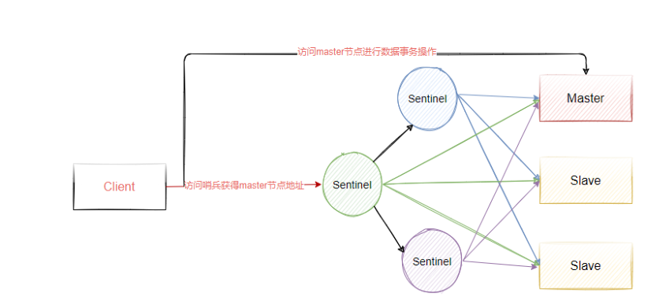

# Redis

# 1. Redis简介

K-V 数据库

基于内存存储

Redis的KV结构是基于dictEntry 实现的，Redis是C语言编写的。


# 2. Redis 数据类型

## 2.1 基本数据类型

### string

* 存储类型：可以用来存储 INT (整数)、float（单精度浮点数）、String（字符串）

* 操作命令

  ```redis
  # 获取指定范围的字符传
  getrange bubble 0 1 
  # 获取值长度
  strlen bubble 
  # 
  ```

  

* 底层实现：底层编码（INT,emstr，raw）SDS（Simple Dynamics String）简单动态字符串，本质上还是字符串数组 char[] ，根据字符串的长度选择合适的数据类型 。SDS(sds.sh)又有多种结构，sdsdr5、sdsdr8、sdsdr16、sdsdr32、sdsdr64 ，分别代表 2^5 = 32 byte、2^8 、2^16、 2^32、 2^64   用于存储不同长度的字符串。

* 使用场景：

  * 缓存热点数据 如：数据字典、报表数据、下拉框选项值，可以显著提升热点数据的访问速度
  * 全局ID：INT类型，incrby  利用原子性
  * 限流器：以访问者的IP和其他信息作为key ,访问一次增加一次计数，超过次数则返回 false 
  * 分布式锁：setnx 只有不存在时才能添加成功

### Hash 哈希

* 存储类型：Hash用来存储多个无序的键值对。最大存储数量2^32-1 (40亿左右) 

* 操作命令：

  ```redis
  hset hl f 6 
  hset hl e 5 
  hmset hl a 1 b 2 c 3 d 4 
  hget hl a 
  hmget a b c d 
  hkeys hl 
  hvals hl 
  hgetall hl 
  
  hdel hl a 
  hlen hl 
  ```

* 底层实现：hashtable 、ziplist 

  * ziplist 压缩列表，是一个经过特殊编码,由来纳许内存块组成的双向链表

* 使用场景：存储用户信息、购物车

### List

- 存储类型：存储有序的字符串，元素可以重复。最大存储数量2^32-1 (40亿左右) 

- 操作命令

  ```redis
  
  ```

  底层实现：quicklist 存储了一个双向链表，每个Node节点都是基于zipList （压缩列表）实现

- 使用场景：发红包、

### Set 

* 存储类型：存储String 类型的无序集合，最大存储数量2^32-1 (40亿左右)  

* 操作命令：

  ```redis 
  
  ```

* 底层实现： inset

* 

### Zset

* 存储类型：sorted set 存储有序的元素。每个元素有个 score，按照score 从小到大排名。score相同时，按照key 的ASII 码排序。
* 操作命令： 
* 底层实现： zipskipList(跳跃表+ hashtable ) 
* 使用场景：排行榜系统的实现、点赞排行榜

## 2.2 其他数据类型

### Bit Maps  

### Hyperloglogs

### Geographic

### Streams

# 3. Redis的高性能

## 3.1 网络IO的通信原理

## 

## 3.2 BIO

阻塞的IO模型

* 连接阻塞
* IO阻塞

使用场景

* nacos的注册地址信息同步

## 3.3 BIO优化


## 3.4 NIO

本意是 New IO，所谓NIO(非阻塞IO), 其实就是取消了IO阻塞和连接阻塞，当服务端不存在阻塞的时候，就可以不断轮询处理客户端请求。

核心： 

* channel
* buffer
* selector 

缺点：

客户端或服务端需要通过一个线程不断轮询才能获得结果，而这个轮询过程中会浪费掉线程资源


## 3.5 I/O多路复用

* I/O指的是网络IO
* 多路指的是多个TCP连接（socket或channel）
* 复用指的是复用一个或多个线程

它的基本原理就是不再由应用程序自己监视连接，而是由内核程序监视文件描述符。

I/O多路复用本质是通过一种机制（系统内核缓冲I/O数据），让单个线程可以监视多个文件描述符，一旦某个文件描述符就绪（一般是读就绪或者写就绪），能够通知程序进行相应的读写操作。

fd（文件描述符）：在Linux设备中内核把所有的外部设备都当成是一个文件来操作，对一个文件的读写会调用内核提供的系统命令，返回一个fd(文件描述符)。而对于一个socket的读写也会有相应的文件描述符，称为 socketfd。

### 3.5.1 常见多路复用方式

#### select 

进程可以通过把一个或者多个fd传递给select系统调用，进程会阻塞在select操作上，这
样select可以帮我们检测多个fd是否处于就绪状态，这个模式有两个缺点:

* 由于他能够同时监听多个文件描述符，假如说有1000个，这个时候如果其中一个fd 处于就绪
  状态了，那么当前进程需要线性轮询所有的fd，也就是监听的fd越多，性能开销越大。
* 同时，select在单个进程中能打开的fd是有限制的，默认是1024，对于那些需要支持单机上
  万的TCP连接来说确实有点少


#### poll 

和select一样针对监控文件描述符的数量做了改进。

#### epoll 

linux还提供了epoll的系统调用，epoll是基于事件驱动方式来代替顺序扫描，因此性能相
对来说更高，主要原理是，当被监听的fd中，有fd就绪时，会告知当前进程具体哪一个fd就绪，那
么当前进程只需要去从指定的fd上读取数据即可，另外，epoll所能支持的fd上线是操作系统的最
大文件句柄，这个数字要远远大于1024

【由于epoll能够通过事件告知应用进程哪个fd是可读的，所以我们也称这种IO为异步非阻塞IO，
当然它是伪异步的，因为它还需要去把数据从内核同步复制到用户空间中，真正的异步非阻塞，
应该是数据已经完全准备好了，我只需要从用户空间读就行】

总结：

1. select是Posix提供的，一般的操作系统都有支持。适用于文件描述符较少的情况，可移植性较好，但在高并发场景下效率较低。
2. poll解决了select对文件描述符数量限制的问题，但在处理大量并发时仍存在效率瓶颈。
3. epoll 是Linux系统内核提供支持的，针对高并发场景进行了深度优化，尤其适合处理成千上万个并发连接，性能表现更佳，但不是所有Unix系统都支持epoll，移植性相对较差。

### 3.5.2 Reactor多路复用

Reactor本质上就是基于NIO多路复用机制提出的一个高性能IO设计模式，它的核心思想是把响应IO事件和业务处理进行分离，通过一个或者多个线程来处理IO事件，然后将就绪得到事件分发到业务处理handlers线程去异步非阻塞处理。

Reactor模型有三个重要的组件：

* Reactor ：将I/O事件发派给对应的Handler
* Acceptor ：处理客户端连接请求
* Handlers ：执行非阻塞读/写

#### 单线程单Reactor模型


Reactor线程，负责多路分离套接字，有新连接到来触发connect 事件之后，交由Acceptor进行处
理，有IO读写事件之后交给hanlder 处理。
Acceptor主要任务就是构建handler ，在获取到和client相关的SocketChannel之后 ，绑定到相应的
hanlder上，对应的SocketChannel有读写事件之后，基于reactor 分发,hanlder就可以处理了（所有的
IO事件都绑定到selector上，由Reactor分发）
Reactor 模式本质上指的是使用 I/O 多路复用(I/O multiplexing) + 非阻塞 I/O(non-
blocking I/O) 的模式。

缺点：

handler的执行是串行的，如果其中一个handler处理线程阻塞将导致其他的业务处理阻塞。由于handler和reactor在同一个线程中的执行，这也将导致新的无法接收新的请求

#### 多线程单Reactor模型

针对单线程Reactor的改进使用多线程的方式来处理业务，也就是在业务处理的地方加入线程池异步
处理，将reactor和handler在不同的线程来执行


#### 多线程多Reactor模型


# 4. Redis内存淘汰机制

### 4.1 Redis缓存问题

* Redis中有很多无效的缓存，这些缓存数据会降低数据IO的性能，因为不同的数据类型时间复杂度

算法不同，数据越多可能会造成性能下降。

* 随着系统的运行，redis的数据越来越多，会导致物理内存不足。通过使用虚拟内存（VM），将很

少访问的数据交换到磁盘上，腾出内存空间的方法来解决物理内存不足的情况。虽然能够解决物理
内存不足导致的问题，但是由于这部分数据是存储在磁盘上，如果在高并发场景中，频繁访问虚拟
内存空间会严重降低系统性能。	

解决方案：

* 对每个存储到redis中的key设置过期时间，这个根据实际业务场景来决定。否则，再大的内存都会

虽则系统运行被消耗完。

* 增加内存
* 使用内存淘汰策略

### 4.2 设置Redis能够使用的最大内存

Redis默认的最大内存 maxmemory=0 ，表示不限制Redis内存的使用。我们可以修改 redis.conf 文
件，设置Redis最大使用的内存。

```redis
# 单位为byte
maxmemory <bytes> 2147483648（2G）
```

- 查看当前Redis最大内存设置

```redis
config get maxmemory
```

### 4.3 Redis内存淘汰策略

Redis一共提供了8种淘汰策略，默认的策略为noeviction，当内存使用达到阈值的时候，
所有引起申请内存的命令会报错。

* volatile-lru，针对设置了过期时间的key，使用lru算法进行淘汰。

* allkeys-lru，针对所有key使用lru算法进行淘汰。

  

* volatile-lfu，针对设置了过期时间的key，使用lfu算法进行淘汰。

* allkeys-lfu，针对所有key使用lfu算法进行淘汰。

  

* volatile-random，从所有设置了过期时间的key中使用随机淘汰的方式进行淘汰。

* allkeys-random，针对所有的key使用随机淘汰机制进行淘汰。

  

* volatile-ttl，删除生存时间最近的一个键。

* noeviction，不删除键，值返回错误。（默认）

### 4.4 内存淘汰算法 LRU/LFU

目的：针对过期Key的处理	

#### LRU

LRU（Least Recently Used）：最近最少使用（最久没有使用）。当内存不够的时候，每次添加一条数据，都需要抛弃一条最久时间没有使用的旧数据。

标准的LRU算法为了降低查找和删除元素的时间复杂度，一般采用Hash表和双向链表结合的数据结构，
hash表可以赋予链表快速查找到某个key是否存在链表中，同时可以快速删除。


双向链表的查找时间复杂度是O(n)，删除和插入是O(1)，借助HashMap结构，可以使得查找的时
间复杂度变成O(1)

Hash表用来查询在链表中的数据位置，链表负责数据的插入，当新数据插入到链表头部时有两种情
况。

* 链表满了，把链表尾部的数据丢弃掉，新加入的缓存直接加入到链表头中。
* 当链表中的某个缓存被命中时，直接把数据移到链表头部，原本在头节点的缓存就向链表尾部移动

这样，经过多次Cache操作之后，最近被命中的缓存，都会存在链表头部的方向，没有命中的，都会在
链表尾部方向，当需要替换内容时，由于链表尾部是最少被命中的，我们只需要淘汰链表尾部的数据即
可。

##### Redis中的LRU算法

Redis使用的LRU算法其实是一种不可靠的LRU算法，它实际淘汰的键并不一定是真正最少使用
的数据，它的工作机制是：

* 随机采集淘汰的key，每次随机选出5个key
* 然后淘汰这5个key中最少使用的key

这5个key是默认的个数，具体的数值可以在redis.conf中配置

```redis
maxmemory-samples 5
```

#### LFU	

LFU（Least Frequently Used），表示最近最少使用，它和key的使用次数有关，其思想是：根据key最
近被访问的频率进行淘汰，比较少访问的key优先淘汰，反之则保留。

LRU的原理是使用计数器来对key进行排序，每次key被访问时，计数器会增大，当计数器越大，意味着
当前key的访问越频繁，也就是意味着它是热点数据。 它很好的解决了LRU算法的缺陷：**一个很久没有**
**被访问的key，偶尔被访问一次，导致被误认为是热点数据的问题。**


LFU维护了两个链表，横向组成的链表用来存储访问频率，每个访问频率的节点下存储另外一个具有相同访问频率的缓存数据。具体的工作原理是：

* 当添加元素时，找到相同访问频次的节点，然后添加到该节点的数据链表的头部。如果该数据链表

满了，则移除链表尾部的节点当获取元素或者修改元素是，都会增加对应key的访问频次，并把当前节点移动到下一个频次节点。

* 添加元素时，访问频率默认为1，随着访问次数的增加，频率不断递增。而当前被访问的元素也会随着频率增加进行移动。

# 5. Redis持久化机制

诉求： 重启或者意外希望数据可以恢复

Redis支持两种方式的持久化，一种是RDB方式、另一种是AOF（append-only-file）方式，两种持久化
方式可以单独使用其中一种，也可以将这两种方式结合使用。

* RDB：根据指定的规则“定时”将内存中的数据存储在硬盘上，
* AOF：每次执行命令后将命令本身记录下来。

## 5.1 RDB模式

RDB的持久化方式是通过快照（snapshotting）完成的，它是Redis默认的持久化方式，配置如下。

```shell
# save 3600 1
# save 300 100
# save 60 10000
```

Redis允许用户自定义快照条件，当符合快照条件时，Redis会自动执行快照操作。快照的条件可以由用
户在配置文件中配置。配置格式如下

```shell
save <seconds> <changes>
```

第一个参数是时间窗口，第二个是键的个数，也就是说，在第一个时间参数配置范围内被更改的键的个
数大于后面的changes时，即符合快照条件。当触发条件时，Redis会自动将内存中的数据生成一份副
本并存储在磁盘上，

#### 生成快照时机

* 根据配置规则进行自动快照
* 用户执行SAVE或者GBSAVE命令
* 执行FLUSHALL命令
* 执行复制(replication)时

关闭RDB的持久化机制，可以参考如下配置，开启 save ，并注释其他规则即可

```
save ""
#save 900 1
#save 300 10
#save 60 10000
```

#### 用户执行SAVE或者GBSAVE命令

1. save命令
  如图4-24所示，当执行save命令时，Redis同步做快照操作，在快照执行过程中会阻塞所有来自客
  户端的请求。当redis内存中的数据较多时，通过该命令将导致Redis较长时间的不响应。所以不建
  议在生产环境上使用这个命令，而是推荐使用bgsave命令


2. bgsave命令
  bgsave命令可以在后台异步地进行快照操作，快照的同时服务器还可以继续响应来自客户端的请求。执行BGSAVE后，Redis会立即返回ok表示开始执行快照操作，在redis-cli终端，通过下面这个命令可以获取最近一次成功执行快照的时间（以 UNIX 时间戳格式表示）。

  ``` 
  LASTSAVE
  ```

  


1：redis使用fork函数复制一份当前进程的副本(子进程)
2：父进程继续接收并处理客户端发来的命令，而子进程开始将内存中的数据写入硬盘中的临时文件
3：当子进程写入完所有数据后会用该临时文件替换旧的RDB文件，至此，一次快照操作完成。
注意：redis在进行快照的过程中不会修改RDB文件，只有快照结束后才会将旧的文件替换成新
的，也就是说任何时候RDB文件都是完整的。 这就使得我们可以通过定时备份RDB文件来实现
redis数据库的备份， RDB文件是经过压缩的二进制文件，占用的空间会小于内存中的数据，更加
利于传输。
bgsave是异步执行快照的，bgsave写入的数据就是for进程时redis的数据状态，一旦完成fork，后续执行的新的客户端命令对数据产生的变更都不会反应到本次快照Redis启动后会读取RDB快照文件，并将数据从硬盘载入到内存。根据数据量大小以及服务器性能不同，这个载入的时间也不同。

#### RDB文件的优势和劣势

一、优势
1.RDB是一个非常紧凑(compact)的文件，它保存了redis 在某个时间点上的数据集，这种文件非常
适合用于进行备份和灾难恢复。
2.生成RDB文件的时候，redis主进程会fork()一个子进程来处理所有保存工作，主进程不需要进行
任何磁盘IO操作。
3.RDB 在恢复大数据集时的速度比AOF的恢复速度要快。
二、劣势
1、RDB方式数据没办法做到实时持久化/秒级持久化。因为bgsave每次运行都要执行fork操作创
建子进程，频繁执行成本过高
2、在一定间隔时间做一次备份，所以如果redis意外down掉的话，就会丢失最后一次快照之后的
所有修改（数据有丢失）。
如果数据相对来说比较重要，希望将损失降到最小，则可以使用AOF方式进行持久化。

## 5.2 AOF模式

AOF(Append Only File)：Redis 默认不开启。AOF采用日志的形式来记录每个写操作，并追加到文件
中。开启后，执行更改Redis数据的命令时，就会把命令写入到AOF文件中。
Redis 重启时会根据日志文件的内容把写指令从前到后执行一次以完成数据的恢复工作。

#### AOF配置开关

``` shell
# 开关
appendonly no /yes
# 文件名
appendfilename "appendonly.aof"
```

#### 重写机制

```
bgrewriteaof
```

AOF 文件重写并不是对原文件进行重新整理，而是直接读取服务器现有的键值对，然后用一条命令去代
替之前记录这个键值对的多条命令，生成一个新的文件后去替换原来的 AOF 文件。

Redis 可以在 AOF 文件体积变得过大时，自动地在后台对 AOF 进行重写： 重写后的新 AOF 文件包含
了恢复当前数据集所需的最小命令集合。


重写的流程是这样，

* 主进程会fork一个子进程出来进行AOF重写，这个重写过程并不是基于原有的aof文件来做的，而

是有点类似于快照的方式，全量遍历内存中的数据，然后逐个序列到aof文件中。

* 在fork子进程这个过程中，服务端仍然可以对外提供服务，那这个时候重写的aof文件的数据和redis内存数据不一致了怎么办？不用担心，这个过程中，主进程的数据更新操作，会缓存到aof_rewrite_buf中，也就是单独开辟一块缓存来存储重写期间收到的命令，当子进程重写完以后再把缓存中的数据追加到新的aof文件。

* 当所有的数据全部追加到新的aof文件中后，把新的aof文件重命名正式的文件名字，此后所有的操作都会被写入新的aof文件。
* 如果在rewrite过程中出现故障，不会影响原来aof文件的正常工作，只有当rewrite完成后才会切换文件。因此这个rewrite过程是比较可靠的。

Redis允许同时开启AOF和RDB，既保证了数据安全又使得进行备份等操作十分容易。如果同时开启
后，Redis重启会使用AOF文件来恢复数据，因为AOF方式的持久化可能丢失的数据更少。

#### AOF的优劣势

优点：
1、AOF 持久化的方法提供了多种的同步频率，即使使用默认的同步频率每秒同步一次，Redis 最多也
就丢失 1 秒的数据而已。
缺点：
1、对于具有相同数据的的Redis，AOF 文件通常会比 RDB 文件体积更大（RDB存的是数据快照）。
2、虽然 AOF 提供了多种同步的频率，默认情况下，每秒同步一次的频率也具有较高的性能。在高并发
的情况下，RDB 比 AOF 具好更好的性能保证。

# Redis高可用

在Redis中，提供了高可用方案包含以下几种：

* 主从复制（用来实现读写分离）
* 哨兵机制（实现master选举）
* 集群机制（实现数据的分片）




